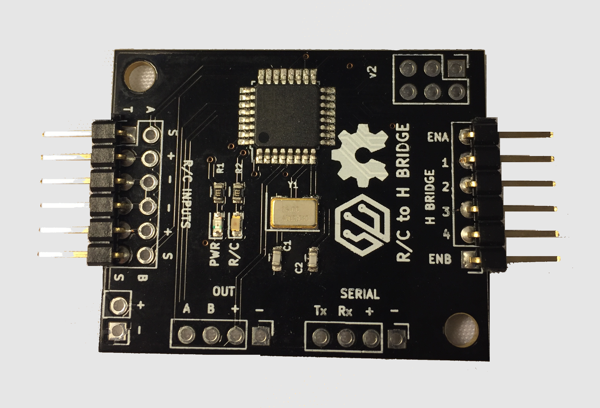

# R/C to H-Bridge

A PCB to convert R/C PPM signals into H-Bridge compatible PWM and direction signals as used by many popular H bridge boards. This allows
the separation of the R/C signal processing from the H bridge, such that you can combine this board with small to very large H bridge
boards.

The default firmware for this board handles the mixing of the Throttle and Steering channels to drive two differential motors, aka "Tank Style". It also has two AUX inputs that map to two digital outputs that allow R/C channels to toggle the outputs LOW and HIGH based on the R/C value. This can be useful to add things like weapon arm/disarm, self-righting mechanisms, lights, etc.

Many H bridge boards in the 2A range are available on Amazon quite cheap, such as [This one](https://www.amazon.com/dp/B01CC8XI60) or
[This one](https://www.amazon.com/L9110S-Stepper-Driver-Atomic-Market/dp/B01ACIALJ4).

# The Board

# Powering

The board requires 5VDC power to operate. It can be powered either from the R/C inputs (which usually come from the R/C receiver which
  gets power from the ESC or BEC) or you can power directly to the + and - port next to the R/C inputs. If powering via the dedicated
  power port, you should disconnect the + in on the R/C inputs.

# Pins

## R/C

The R/C inputs connect directly to an R/C receiver. By default R/C center is 1500uS, and max throw is +/- 500uS in each direction.

All R/C inputs have a Dead Zone which when the input is +/- this value from center (1500uS) the value will not trigger any
change in outputs nor apply power changes to the motors. The default Dead Zone is 25uS.

* T :: Throttle input - expected to be neutral throttle at 1500uS R/C value
* S :: Steering input - expects neutral left/right travel at 1500uS R/C value
* A :: AUX A - Values above R/C center + Dead Zone will turn OUT A to HIGH, values below R/C center - Dead Zone will turn OUT A to LOW
* B :: AUX B - Same as AUX A, but controls OUT B

## H bridge

The H Bridge side of the board is designed to interface to H-Bridge with either 4 or 6 pin controllers. The EN pins contain
the PWM signal and the corresponding 1/2 or 3/4 pins will either be LOW/HIGH or HIGH/LOW based on the mixed input of the
throttle/steering R/C signals to control the direction of the motors. The actual PWM signal format will depend on if the
board is in 4 or 6 pin mode. This is detailed in the next section. The PWM signal is also affected by if breaking is enabled
or not.

To connect 6 pin H Bridges, simply connect the ENA/1/2 pins to the first motor inputs and ENB/3/4 to the second motors inputs.

To connect a 4 pin H Bridge, connect ENA/1 to the first motor and ENB/4 to the second. The 1 and 4 pins will toggle between
LOW and HIGH to control direction. If you need to change motor direction and cannot do so by reversing the motor wires, you
can use pins 2 and 3 instead.

## PWM Modes

This firmware supports 6 and 4 pin dual channel H-Bridge boards. The format for the PWM signal is different depending on
the PWM mode as well as if breaking is enabled. The mode can be adjusted by placing the board in configuration mode. To
enter configuration mode, make sure the R/C transmitter is on, place a jumper across the H-bridge pins 2 and 3 and then
power on the R/C to H-Bridge board. At power on, if the board sees H-bridge pins 2 and 3 connected together,
it will go into configuration mode.

Configuration mode can be seen by the R/C status LED blinking 5 times at startup. Then every 4 seconds, the R/C status
will blink a certain number of times, corresponding to the current active PWM mode. To change the mode, use the steering
channel all the way to the left or right to change the current mode. The following table outlines the different modes:

| Mode Number   | Mode Name                 | Common H-Bridge Chips |
| ------------- | ------------------------- | --------------------- |
| 1             | 4 PIN PWM, no breaking    | L9110S                |
| 2             | 4 PIN PWM, with breaking  | L9110S                |
| 3             | 6 PIN PWM, no breaking    | L-298                 |
| 4             | 6 PIN PWM, with breaking  | L-298                 |

After the desired configuration mode is set by using the steering channel, unplug the power to the R/C to H-Bridge board
and remove the jumper between H-Bridge pins 2 and 3. Powering the board will start it up in normal mode, outputting the
new mode to the PWM pins on the H-Bridge.

## Breaking

If breaking is enabled (PWM modes 2 or 4), then if the throttle is in the forward direction and you switch the throttle into
reverse, rather than instantly flipping the motors into reverse, a breaking operation is sent to the H-Bridge. It will remain
in the breaking state until the throttle returns back to center, and then the next time the throttle goes into reverse the
motors will actually be driven in reverse.

## OUT

The OUT ports A and B toggle from LOW to HIGH based on the R/C input signals connected to inputs A and B. There is also
5v power available on the OUT port.

## SERIAL

This port is designed as an expansion port for future use and/or hacking. It provides a TTL serial connection to the ATMega
chip along with 5v power.
